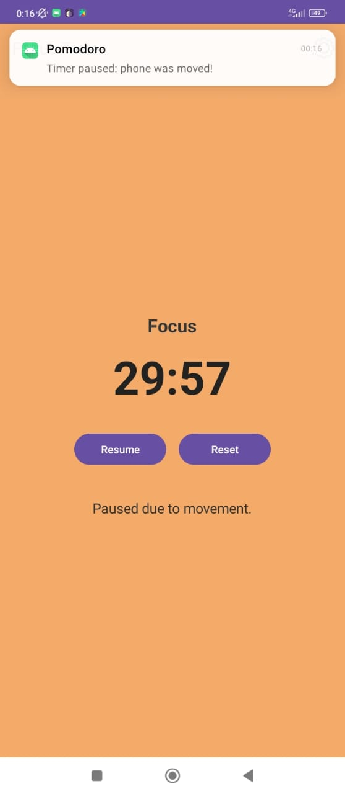
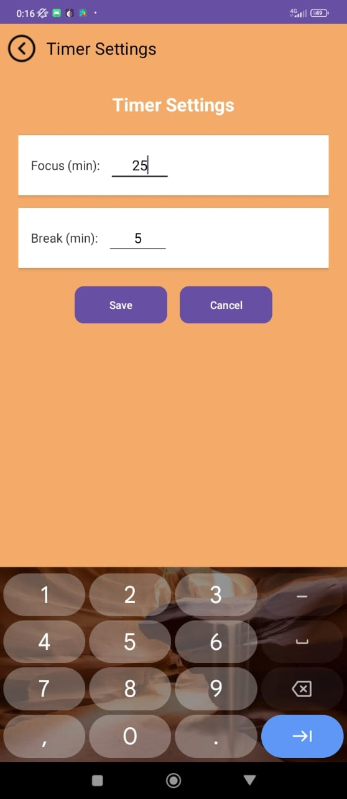

# Study_Focus_App_with_ML

## Overview
This project is a Pomodoro Timer mobile app integrated with a machine learning model to detect phone motion using accelerometer data. The app helps users stay focused by pausing the timer when phone movement indicative of distraction is detected during study sessions.

## Features
- Real-time motion detection using accelerometer sensor data
- ML model trained on spectral features extracted with Edge Impulse
- Neural network classifier achieving 87% accuracy for stationary vs. pick-up states
- Model deployed on-device using TensorFlow Lite for offline inference
- Customizable Pomodoro timer with focus and break intervals
- Motion-triggered pause with notifications to minimize distractions

## Technologies
- Edge Impulse (spectral analysis, model training)
- TensorFlow Lite (model deployment)
- Android Studio, Kotlin, Java (mobile app development)
- Accelerometer sensor data processing
- Neural Networks

## Installation
1. Clone this repository:
-`https://github.com/yourusername/pomodoro-ml-motion.git`
2. Open the project in Android Studio.
3. Build and run on an Android device with accelerometer sensor.

## Usage
- Set your desired focus and break durations in the app settings
- Start the Pomodoro timer to begin a focus session
- The app will automatically detect phone movement and pause the timer with a notification to help reduce distractions

## Future Improvements
- Multi-sensor fusion to improve motion detection accuracy
- Personalized models adapting to user behavior
- Enhanced UI and user experience

## License
This project is licensed under the MIT License.
